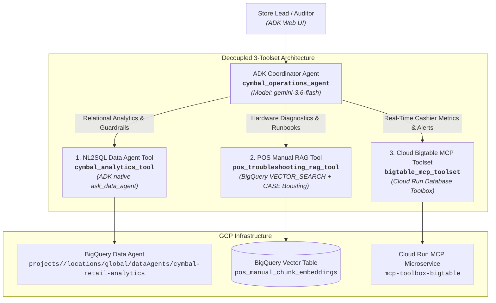

# Cymbal Operations Agent (`da-elevate-day3-agent`)

Enterprise multi-tool operational AI coordinator built on **Google Agent Development Kit (ADK)** and powered by **Gemini 2.5/3.x** for Cymbal Retail store operations, POS hardware diagnostics, real-time cashier risk audits, and cross-cloud transaction forensics.

---

## 🏛️ Architecture: Hub-and-Spoke Coordinator Topology

The agent adopts a decoupled Hub-and-Spoke architecture with the root coordinator (`cymbal_operations_agent`) dynamically orchestrating specialized platform toolsets:



---

## 🛠️ Toolsets & Guardrail Capabilities

### 1. `cymbal_analytics_tool` (NL2SQL Platform Analytics)
- Leverages ADK's native `ask_data_agent` (`google.adk.tools.data_agent.data_agent_tool.ask_data_agent`) with server-side parameter pinning.
- Passes enterprise business terms (*Net Transaction Revenue*, *Total On-Hand Inventory*, *Estimated Cover Hours*) verbatim without keyword degradation.
- **Mandatory Partition Clarification Guardrail:** Pre-execution interceptor pauses and asks for clarification whenever an open-ended, unbounded query targets partitioned ledgers (`pos_transactions_gold`, `pos_anomaly_alerts`) to avoid costly full table scans.

### 2. `pos_troubleshooting_rag_tool` (Hardware Diagnostic RAG)
- Powered by BigQuery `VECTOR_SEARCH` over fine-grained sliding window chunks (`pos_manual_chunk_embeddings`).
- **SQL-Level CASE Error Boosting:** Boosts similarity score to `0.9900` when the chunk content matches an extracted error code (e.g. `ERR-PAY-4001`).
- **Universal Text Fallback Search:** Extracts and cleans query keywords for full-text `SEARCH()` if vector search confidence is below `0.70`.
- **Mandatory Decline Protocol:** Low-confidence or out-of-scope inquiries return the exact SDD string:
  > *"I cannot find certified warranty or repair rules for this specific error in our technical repository."*

### 3. `bigtable_mcp_toolset` & Cashier Alert Readers
- Interacts with Cloud Bigtable (`operations-db`) through Cloud Run containerized Database Toolbox.
- Unpacks 8-byte big-endian doubles (`>d`) and 64-bit integers (`>q`) from base64 streams into typed operational metrics:
  - `cashier_1h_override_rate` (percentage of transactions with manual price overrides).
  - `audit_status` (`REVIEW` vs `CLEAR`).
- Provides `read_pos_transactions_enriched` for low-latency transaction fact and anomaly alert inspection.

---

## 🚀 Getting Started & Local Development

### 1. Prerequisites
- Python 3.11+
- Google Cloud SDK (`gcloud`)
- `uv` (recommended) or `pip`

### 2. Environment Setup
Clone the repository and copy the environment template:
```bash
git clone https://github.com/mic-xiaoyj/da-elevate-day3-agent.git
cd da-elevate-day3-agent
cp .env.example .env
```

Edit `.env` with your project parameters:
```bash
PROJECT_ID=your-gcp-project-id
REGION=us-central1
DATA_AGENT_NAME=projects/your-gcp-project-id/locations/global/dataAgents/cymbal-retail-analytics
BIGTABLE_MCP_URL=https://mcp-toolbox-bigtable-<PROJECT_NUMBER>.<REGION>.run.app
GOOGLE_GENAI_USE_VERTEXAI=true
GOOGLE_CLOUD_PROJECT=your-gcp-project-id
GOOGLE_CLOUD_LOCATION=global
COORDINATOR_MODEL=gemini-3.6-flash
```

### 3. Dependency Installation
```bash
make install
# Or manually:
uv venv .venv && source .venv/bin/activate
uv pip install -r requirements.txt pytest pytest-mock pytest-asyncio
```

---

## 🧪 Testing & Validation

### Offline Unit Testing (Mock-Supported)
Execute the isolated unit test suite without requiring active cloud credentials or network access:
```bash
make test
# Or:
source .venv/bin/activate && pytest -v tests/
```

Test Coverage Includes:
- `test_analytics_tool.py`: `ask_data_agent` formatting, exponential backoff, and partition guardrail triggers.
- `test_rag_tool.py`: Error code token extraction, SQL error-boosting, and exact SDD decline message.
- `test_bigtable_tool.py`: Big-endian binary metric decoding and real-time alert parsing.
- `test_agent.py`: Coordinator tool bindings and system instruction validation.

### Live Operational Verification Suite
Execute the 7-scenario end-to-end benchmark suite:
```bash
make eval
# Or:
source .venv/bin/activate && python run_validation_suite.py
```

Benchmark Scenarios:
| Scenario | Category | Verification Protocol |
| :--- | :--- | :--- |
| **UC 1.1a** | Hardware Error | Retrieves Toshiba TCx 810 guide with non-double-charge protocol. |
| **UC 1.1c** | Out-of-Scope Hardware | Emits SDD decline text for non-POS queries. |
| **UC 1.2a** | Stockout Risk (<20h) | Filters `gold_inventory_reconciliation_ledger` for cover hours < 20. |
| **UC 1.3** | Live Cashier Metrics | Inspects Bigtable for `STORE_048#CASH_1190` metrics and flags. |
| **UC 2.1a** | Warranty Transaction | Unnests transaction items and correlates warranty terms. |
| **UC 2.2** | Dual Cashier Baseline | **Parallel Turn 1 dispatch** comparing live Bigtable rate vs 7-day BQ baseline. |
| **UC 2.3** | Cross-Cloud Offender Audit | **Sequential multi-turn dispatch** (GCP anomaly ranking -> AWS S3 checkout logs). |

---

## 🐳 Containerization & Deployment

### Build Container Image
```bash
make build
# Or:
docker build -t cymbal-operations-agent:latest .
```

### Deploy with Terraform
Infrastructure-as-Code templates are provided under `terraform/`:
```bash
cd terraform
terraform init
terraform plan -var="project_id=your-gcp-project-id"
terraform apply -var="project_id=your-gcp-project-id"
```

Resources Provisioned:
- Dedicated Service Account `cymbal-operations-agent-sa` with least-privilege IAM roles.
- Secret Manager Secret `bigtable-mcp-tools-secret` mounting `tools.yaml`.
- Cloud Run service hosting Database Toolbox MCP container.

---

## 📄 License
Internal use for Cymbal Retail Operations Engineering and Elevate Data Analytics Labs.
